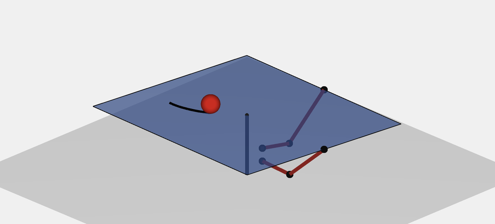

# 2D Ball Balancer

A nonlinear coupled 2D ball balancing system actuated by two orthogonal 2R planar robotic arms and controlled using a PID-based numerical feedback linearization approach.

## Project Overview

This project presents the mathematical modeling, simulation, control design, and visualization of a nonlinear 2D ball balancing system. The system consists of a ball moving on a tilting plate, where the plate orientation is generated through two planar robotic arm mechanisms.

The PID controller generates desired ball accelerations. These virtual acceleration commands are then converted into physically realizable plate and actuator commands through a numerical inverse mapping layer, inverse kinematics, actuator dynamics, and forward kinematics.

## Key Features

- Nonlinear coupled ball-on-plate dynamics
- PID-based trajectory tracking control
- Numerical feedback linearization using nonlinear root-finding
- Inverse and forward kinematics of 2R planar robotic arms
- Servo actuator dynamics and velocity rate limiting
- Time-domain tracking and actuator saturation analysis
- Empirical frequency-domain characterization
- MATLAB implementation
- 3D animation of the system response
- Full technical report

## Repository Structure

- `matlab/` MATLAB scripts for simulation, validation, frequency-domain analysis, and animation
- `report/` Final technical report
- `video/` Demonstration video
- `images/` Preview image and repository visuals

## Report

[Open the full technical report](report/2D_Ball_Balancer_Report.pdf)

## Demo Video

[Watch the demonstration animation](video/2D_Ball_Balancer_Demo.mov)

## Main MATLAB Files

- `main_pid_ball_balancer.m` Main simulation, PID control, plots, and animation call
- `launch3DAnimationPlayer.m` 3D animation player
- `fsolve_validation.m` Numerical feedback linearization residual validation
- `pid_frequency_analysis.m` Frequency-domain tracking, error, and disturbance analysis

## Author

Ege Özbülbül  
Bilkent University – Mechanical Engineering